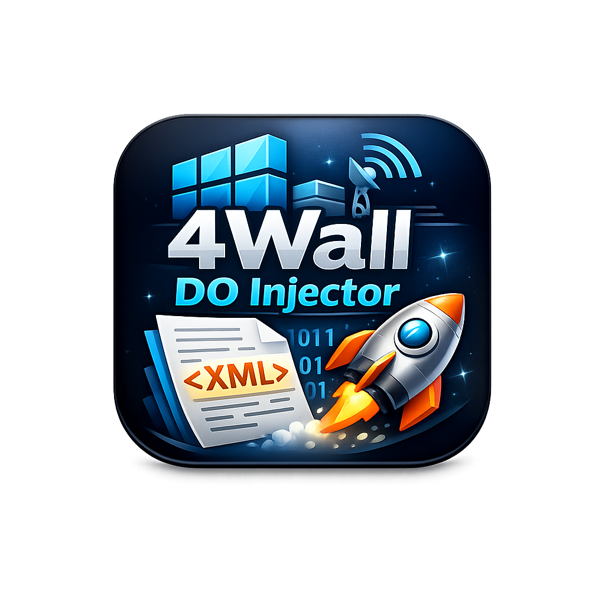

# Kafka Message Publisher 🚀
> QA Utility for Publishing Messages to Kafka

A desktop GUI utility built to streamline publishing messages, payloads, and events directly to Kafka topics. Ideal for QA and integration testing workflows.

---

## 👁️ UI Preview


---

## ✨ Features
* **Format Support:** Publish messages in **XML**, **JSON**, or raw **Text** format.
* **Message Validator:** Integrated schema check/validation before sending.
* **Connection Testing:** Quick test connectivity to different environments and brokers.
* **Topic Configuration:** Auto-fetch list of Kafka topics directly from the broker.
* **Message History log:** Tracks sent messages and status directly in the UI.
* **Message Tracker:** Search key capability to check message consumption status.

---

## 📋 Running the App
* Run the Python script directly:
  ```bash
  python Kafka_ui_updated.py
  ```
* Or run the compiled Windows binary:
  ```text
  dist/Kafka_ui_updated.exe
  ```
